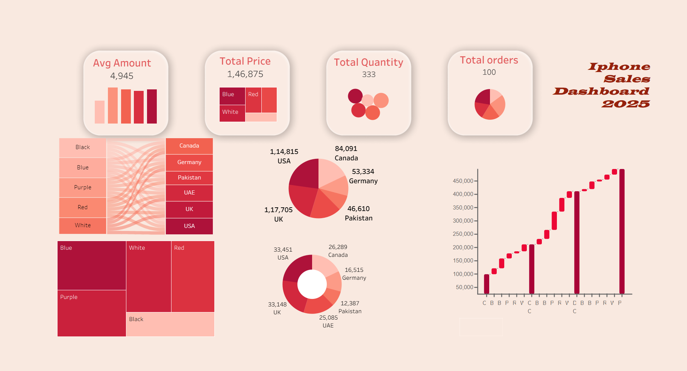

iPhone Sales Tableau Dashboard

Project Overview

The **iPhone Sales Tableau Dashboard** is an interactive data visualization project developed using **Tableau Desktop**. It provides meaningful insights into iPhone sales performance by analyzing revenue, customer ratings, product sales, and regional trends. The dashboard enables users to explore the data through interactive filters and visualizations, making it easier to identify business patterns and support data-driven decision-making.

---

Dashboard Preview



---

 Objectives

- Analyze overall iPhone sales performance.
- Compare sales across different regions.
- Identify top-selling iPhone models.
- Monitor customer ratings and reviews.
- Track revenue and sales trends.
- Support business decisions using interactive visualizations.

---

 Dashboard Features

-  Sales Performance Analysis
-  Revenue Overview
-  Customer Rating Analysis
-  Product-wise Sales Comparison
-  Region-wise Sales Analysis
-  Interactive Filters
-  Dynamic Charts and Visualizations

---

 Dataset Information

The dashboard uses an iPhone sales dataset containing information such as:

- Product Name
- Brand
- Selling Price
- Original Price
- Customer Ratings
- Number of Ratings
- Number of Reviews
- Discount Percentage

**Dataset File**

- `iphone_sales_dataset.csv`

---

 Tools & Technologies Used

- Tableau Desktop
- Microsoft Excel / CSV Dataset
- GitHub
- Data Visualization

---

 Repository Structure

```text
iPhone-Sales-Tableau-Dashboard/
│
├── README.md
├── Dashboard.png
├── iphone sales (share).twbx
└── iphone_sales_dataset.csv
```

---

 How to Use

1. Clone or download this repository.
2. Open the file **`iphone sales (share).twbx`** using Tableau Desktop or Tableau Public.
3. Interact with the dashboard using the available filters.
4. Explore sales trends, customer ratings, and product performance.

---

 Key Insights

- Compare sales performance across products.
- Identify the highest-rated iPhone models.
- Analyze pricing and discount trends.
- Monitor customer reviews and ratings.
- Discover sales patterns for better business decisions.

---

Files Included

| File | Description |
|------|-------------|
| `iphone sales (share).twbx` | Tableau Packaged Workbook |
| `iphone_sales_dataset.csv` | Dataset used for the dashboard |
| `Dashboard.png` | Dashboard preview image |
| `README.md` | Project documentation |

---

 Future Enhancements

- Add sales forecasting using Tableau Forecast.
- Integrate live sales data.
- Include customer segmentation analysis.
- Build additional KPI dashboards.
- Publish the dashboard on Tableau Public.

---

 Author

**Naina Dadheech**

**B.Tech – Computer Science and Engineering (Data Science & Machine Learning)**
